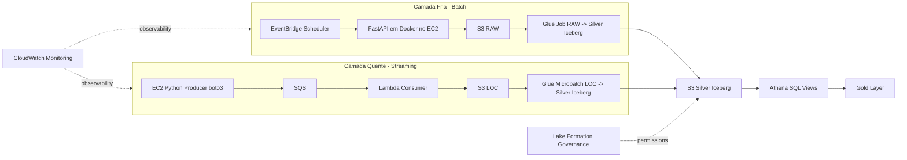

# Esqueleto de Plataforma de Dados AWS (Camada Fria + Camada Quente)

Este repositório entrega um **esqueleto funcional** para um time de desenvolvimento implementar uma plataforma de dados em AWS com duas camadas:
- **Camada fria (batch)**
- **Camada quente (streaming)**

O foco deste projeto e: **estrutura, organizacao, pipeline de qualidade e guias de implementacao**. Nao e a implementacao final de negocio.

## 1. Objetivo

Fornecer uma base padronizada para desenvolvimento de infraestrutura e componentes de ingestao/transformacao, garantindo:
- Provisionamento por Terraform
- Separacao clara de responsabilidades por modulo
- Pipeline CI com testes unitarios, integracao e TAC (tests-as-code para infraestrutura)
- Integracao com SonarQube com exigencia de cobertura minima de 90%
- Documentacao completa para onboarding do desenvolvedor

## 2. Arquitetura Alvo

### 2.1 Visao Geral



### 2.2 Fluxo Frio (Batch)
1. EventBridge dispara em intervalo fixo.
2. API FastAPI em EC2 (container Docker) recebe requisicao e extrai dados.
3. Dados sao persistidos na camada RAW (S3).
4. Glue Job transforma RAW para Silver em formato Iceberg no S3.
5. Athena cria views SQL para camada Gold.

### 2.3 Fluxo Quente (Streaming)
1. EC2 produtor executa codigo Python (boto3) e gera eventos.
2. Eventos sao enviados para SQS.
3. Lambda consumidora processa a fila e persiste dados na camada LOC no S3.
4. Glue em microbatch transforma LOC para Silver em formato Iceberg.
5. Athena cria views SQL Gold unificando frio e quente.

## 3. Estrutura do Repositorio

```text
.
├── .github/workflows/ci.yml
├── Makefile
├── pyproject.toml
├── requirements-dev.txt
├── sonar-project.properties
├── src/
│   ├── cold_api/
│   │   ├── Dockerfile
│   │   └── app/
│   │       ├── main.py
│   │       └── schemas.py
│   ├── hot_lambda/
│   │   └── handler.py
│   └── hot_producer/
│       └── producer.py
├── sql/
│   └── athena/
│       └── gold_views.sql
├── terraform/
│   ├── main.tf
│   ├── outputs.tf
│   ├── providers.tf
│   ├── terraform.tfvars.example
│   ├── variables.tf
│   ├── versions.tf
│   └── modules/
│       ├── cold_layer/
│       ├── data_lake/
│       ├── governance_monitoring/
│       └── hot_layer/
└── tests/
    ├── integration/
    ├── tac/
    └── unit/
```

## 4. Requisitos Funcionais

### RF-01 Camada Fria
- O sistema deve executar ingestao batch periodica via EventBridge.
- O sistema deve consultar API FastAPI em EC2 Dockerizado.
- O sistema deve persistir payload bruto no S3 RAW.
- O sistema deve transformar RAW em Silver Iceberg via Glue Job.

### RF-02 Camada Quente
- O sistema deve gerar eventos via produtor Python em EC2.
- O sistema deve enfileirar eventos no SQS.
- O sistema deve consumir eventos com Lambda e salvar no S3 LOC.
- O sistema deve transformar LOC em Silver Iceberg via Glue microbatch.

### RF-03 Camada Gold
- O sistema deve disponibilizar views em Athena para consumo analitico.
- As views Gold devem unificar dados da Silver de ambas as camadas.

### RF-04 Governanca e Observabilidade
- Governanca de dados e permissoes deve ser controlada por Lake Formation.
- Logs, metricas e alarmes devem ser publicados no CloudWatch.

## 5. Requisitos Tecnicos

### RT-01 Infraestrutura como Codigo
- Todo provisionamento deve ser feito com Terraform.
- Modulos Terraform devem manter separacao por dominio (cold/hot/lake/governance).
- Variaveis, outputs e tags devem ser padronizados por ambiente.

### RT-02 Qualidade e Testes
- Testes unitarios e de integracao para componentes Python.
- TAC para garantir base de infraestrutura e contratos minimos de IaC.
- Cobertura minima de 90% no pipeline.

### RT-03 Pipeline CI/CD
- Esteira GitHub Actions deve executar lint, unit, integration e TAC.
- Esteira deve incluir scans de seguranca (Bandit e pip-audit).
- Qualidade deve passar por SonarQube (scan + quality gate).
- Aprovacao deve considerar cobertura minima >= 90%.

## 6. O Que Ja Esta Pronto no Esqueleto

- FastAPI com endpoints de contrato (`/health`, `/ingest`).
- Produtor hot e handler Lambda em modo stub.
- Modulos Terraform separados para os blocos principais da arquitetura.
- Buckets RAW/LOC/Silver no modulo de data lake.
- Placeholders de EC2, EventBridge, SQS, Lambda, Glue e CloudWatch.
- SQL inicial de view Gold unificada.
- Testes unitarios, integracao e TAC configurados.
- Pipeline GitHub Actions com jobs separados.
- SonarQube configurado para ler `coverage.xml`.

## 7. Lacunas Planejadas (Implementacao do Desenvolvedor)

1. Networking completo (VPC, subnets, NAT/IGW, security groups, endpoints).
2. IAM minimo privilegio para EC2, Glue, Lambda, EventBridge e Athena.
3. Empacotamento e deploy de artefatos (Lambda ZIP e scripts Glue).
4. Catalogacao Glue/Athena para tabelas Iceberg e particionamento.
5. Definicao de esquema/contratos de dados e evolucao de schema.
6. Politicas Lake Formation (admins, grants, LF-tags).
7. Alarmes e dashboards CloudWatch por SLO/SLI.
8. Estrategias de retry, DLQ, idempotencia e observabilidade de erros.

## 8. Como Rodar Localmente

### 8.1 Pre-requisitos
- Python 3.11+
- Terraform 1.7+
- GNU Make

### 8.2 Setup

```bash
python3 -m pip install -r requirements-dev.txt
cp terraform/terraform.tfvars.example terraform/terraform.tfvars
```

### 8.3 Comandos

```bash
make lint
make test-unit
make test-integration
make test-tac
```

## 9. Pipeline GitHub Actions

Workflows:
- `.github/workflows/feature-validation.yml`
  - Dispara em push para branches `feature*`.
  - Executa lint, Bandit, pip-audit, testes unitarios/integracao, gate de cobertura >= 90% e `terraform validate`.

- `.github/workflows/pr-validation.yml`
  - Dispara em PR para `main`.
  - Executa qualidade e seguranca, `terraform fmt/validate`, `terraform plan` e SonarQube (quando secrets estiverem configurados).

- `.github/workflows/main-production.yml`
  - Dispara em push para `main`.
  - Revalida qualidade/seguranca e permite deploy Terraform em producao quando explicitamente habilitado.

### 9.1 Secrets/Variables Necessarios
Configurar no repositorio:
- `SONAR_TOKEN`
- `SONAR_HOST_URL`
- `AWS_ROLE_TO_ASSUME` (para deploy via OIDC no workflow de producao)

Configurar variable:
- `ENABLE_TF_APPLY` = `true` para habilitar `terraform apply` em `main-production.yml`

## 10. SonarQube e Cobertura 90%

O projeto ja aplica cobertura minima de 90% em dois niveis:
- `pytest --cov-fail-under=90` no `pyproject.toml`
- Quality Gate do SonarQube no job `sonarqube`

> Importante: no SonarQube, configure o Quality Gate do projeto com regra de cobertura >= 90% em *New Code* e/ou *Overall Code* conforme a politica da equipe.

## 11. Estrategia de Evolucao Recomendada

1. Implementar base de rede e seguranca primeiro.
2. Fechar caminho frio ponta a ponta (EventBridge -> API -> RAW -> Glue -> Silver).
3. Fechar caminho quente ponta a ponta (EC2 producer -> SQS -> Lambda -> LOC -> Glue).
4. Unificar visoes Gold no Athena.
5. Endurecer governanca (Lake Formation) e observabilidade (CloudWatch).
6. Aumentar cobertura de testes para casos de erro, retentativas e contratos de dados.

## 12. Convencoes Sugeridas para Time

- Nomenclatura de recursos: `${project}-${env}-${componente}`
- Ambiente unico: `production` (projeto de aprendizado).
- Um modulo Terraform por contexto de dominio.
- PRs pequenos e com checklist de validacao:
  - terraform fmt/validate/plan
  - testes unitarios/integracao/tac
  - bandit + pip-audit
  - cobertura >= 90%
  - quality gate SonarQube aprovado

## 13. Observacoes Finais

Este repositorio foi intencionalmente desenhado como base de implementacao.
Ele prioriza:
- organizacao,
- contratos minimos,
- qualidade automatizada,
- e clareza para onboarding de desenvolvedores.

## Referencias para a Sprint 1
[Terraform - Provider AWS](https://registry.terraform.io/providers/hashicorp/aws/latest/docs)
[Introducao a Testes Unitarios](https://www.youtube.com/watch?v=pZvhZ-Lr-PE)
[Introducao a Testes com mock](https://www.youtube.com/watch?v=8uiMnwIkPYA)
[Pytest Fixtures](https://www.youtube.com/watch?v=sidi9Z_IkLU)
[Playlist Desenvolvimento de uma lib - Importante para aprender tecnicas de programacao profissional](https://www.youtube.com/watch?v=R3hCkU4EXgY)
[Curso FastAPI - Gratuito](https://www.youtube.com/watch?v=ImhYlISeWPQ&list=PLOQgLBuj2-3KT9ZWvPmaGFQ0KjIez0403)
[Curso FastAPI - Pago](https://www.udemy.com/course/fastapi-apis-modernas-e-assincronas-com-python/?referralCode=6E89EB8C04280DEA5983)
[Curso AWS - Essencial](https://www.udemy.com/course/amazon-web-services-essencial/?referralCode=835315E4467A40447001)
[Programacao Assincrona](https://www.udemy.com/course/programacao-concorrente-e-assincrona-com-python/?referralCode=CDFB0EDDE8648B7DDE15)
[Curso Design Patterns](https://www.udemy.com/course/padroes-de-projeto-com-python/?referralCode=0BC87A15DEC26B50505B)
[Design Patterns docs](https://refactoring.guru/design-patterns)
[Livro Computacao](https://www.amazon.com.br/Cientista-Computa%C3%A7%C3%A3o-Autodidata-Estruturas-Algoritmos/dp/8575228374/ref=sr_1_1?__mk_pt_BR=%C3%85M%C3%85%C5%BD%C3%95%C3%91&crid=21HYZK2Y40TWD&dib=eyJ2IjoiMSJ9.k-TIy9ot0B7FvP05Tc4SQHxMum3WXb7YClwTRyVdjLdYyTGU56pOTqp4D6AKHqTpybcc860XhceEnb9gjSYP3G-HZBTW_aENE3u78mZv4UkNBo7iv_JDTYRcLQM7ymxWt3EK7xPNMLNjkUpC0q94sk0l9L29gwMJEQX-Ms-WfMwHNvKvS80a3oilKmbu-0Gl.0p77zmiCSmrdfCuzAKvrYNGCUcq1FSRizMqQlPoKz6k&dib_tag=se&keywords=Cientista+da+Computa%C3%A7%C3%A3o+Autodidata&qid=1778100752&s=books&sprefix=cientista+da+computa%C3%A7%C3%A3o+autodidata%2Cstripbooks%2C217&sr=1-1)
[Curso esteira de Dados](https://cursos.alura.com.br/formacao-devops)
[Testes Integracao](https://www.youtube.com/watch?v=qq8b1bck9AU)
[Pipeline Terraform - Usar como referencia](https://www.youtube.com/watch?v=1TNAUW7_bC0)
[Curso Docker](https://www.udemy.com/course/docker-essencial-para-o-desenvolvedor/?referralCode=4180ED98E508AEAAE5FF)

[Shadow Traffic](https://shadowtraffic.io/)
[Curso de Claude Code - Recomendado](https://www.youtube.com/watch?v=MzMM5iV3GcU)
